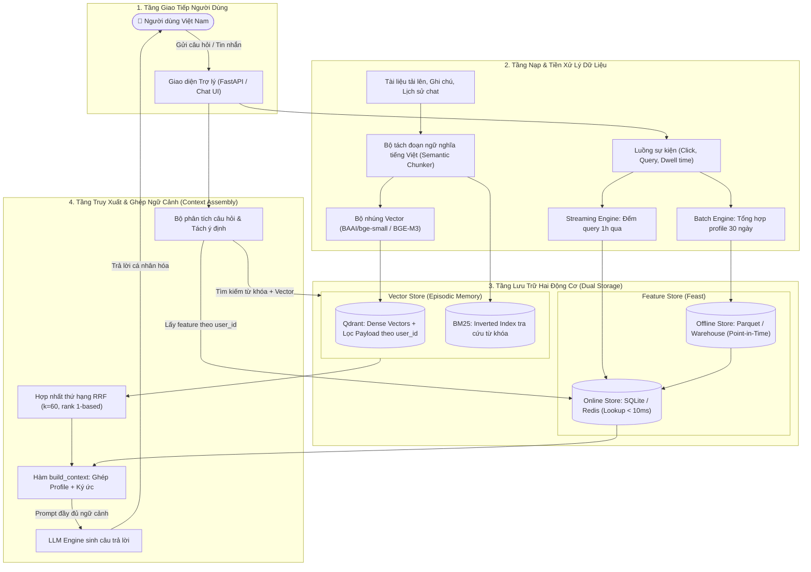

# Tài Liệu Thiết Kế Kiến Trúc: Trợ Lý AI Cá Nhân Hóa Với Bộ Nhớ Lai (Hybrid Memory)

**Người thực hiện:** Hồ Văn Thi (MSSV: 2A202601907)  
**Lớp / Cohort:** A20 — K3 - Track 2 (Day 19 Lab)  
**Đề tài Bonus:** Xây dựng kiến trúc Hybrid Memory cho Trợ lý AI cá nhân tại Việt Nam

---

## 1. Đặt Vấn Đề & Ý Tưởng Xuất Phát

Khi bắt tay vào bài toán xây dựng một "trợ lý AI cá nhân" cho người dùng Việt Nam (kiểu như kết hợp khả năng trò chuyện của ChatGPT với khả năng nhớ tài liệu chuyên sâu của NotebookLM), vấn đề lớn nhất mà em nhận thấy là: **LLM vốn dĩ không có trạng thái (stateless)**. 

Nếu ta cứ nhồi nhét toàn bộ lịch sử chat và tài liệu người dùng vào `prompt context`, hệ thống sẽ gặp ngay 3 "cục tạ":
1. **Cháy token budget:** Vừa tốn tiền API vừa chạm trần context window rất nhanh.
2. **Loãng ngữ cảnh (Prompt Pollution):** Quá nhiều thông tin rác khiến LLM bị phân tâm và dễ bị ảo giác (hallucination).
3. **Mất tín hiệu dài hạn:** LLM không tự biết người dùng này đọc nhanh hay chậm, thích dùng tiếng Anh hay tiếng Việt, hay đang tìm kiếm dồn dập vì bị deadline dí.

Từ bài học của Lab 19, em quyết định tách biệt hoàn toàn hai loại bộ nhớ và ghép chúng lại qua **Kiến trúc Bộ Nhớ Lai Hai Tầng (Dual-Engine Hybrid Memory)**:
* **Episodic Memory (Bộ nhớ sự kiện / Ký ức vụn vặt):** Những gì user từng nói, tài liệu họ tải lên, ghi chú họ viết. Càng nhiều tài liệu thì càng cần công cụ tìm kiếm thông minh $\rightarrow$ **Vector Store (Qdrant) kết hợp BM25 qua thuật toán RRF ($k=60$)**.
* **Stable Profile & Real-time Velocity (Hồ sơ người dùng & Tần suất hoạt động):** Các thuộc tính dạng bảng ổn định (ngôn ngữ ưu tiên, tốc độ đọc, chủ đề yêu thích) và các tín hiệu thời gian thực (số query trong 1 giờ qua) $\rightarrow$ **Feature Store (Feast SQLite/Redis)** với độ trễ tra cứu siêu tốc dưới 10ms.

---

## 2. Sơ Đồ Kiến Trúc Hệ Thống (Architecture Flow)

Dưới đây là sơ đồ luồng dữ liệu mà em thiết kế cho hệ thống:

---

## 3. Ba Quyết Định Kiến Trúc Cốt Lõi & Phân Tích Đánh Đổi (Tradeoffs)

Em không chọn công nghệ theo phong trào mà cân nhắc kỹ các bài toán đánh đổi giữa chi phí, độ phức tạp và hiệu quả thực tế:

### Quyết định 1: Cắt đoạn bộ nhớ (Chunking) — Phân đoạn theo đoạn văn ngữ nghĩa vs. Cắt token cố định
* **Lựa chọn của em:** Em chọn **Semantic Paragraph Chunking** (cắt theo đoạn văn trọn nghĩa kèm phát hiện ngắt câu) thay vì cắt cứng theo số lượng token (Fixed sliding window 512 tokens + 50 tokens overlap).
* **Vì sao em chọn như vậy? (Tradeoff):**
  * *Cắt token cố định:* Rất dễ code, mảng vector đều tăm tắp, nhưng lại có nhược điểm chí mạng là hay cắt đôi câu văn hoặc ngắt ngang một đoạn giải thích kỹ thuật. Trong tiếng Việt, nếu bị cắt đứt giữa chừng thì vector nhúng ra sẽ bị sai lệch ngữ nghĩa rất nặng.
  * *Cắt theo đoạn ngữ nghĩa:* Dù kích thước mỗi đoạn không đều nhau (từ 80 đến 450 tokens), nhưng mỗi chunk giữ nguyên được một ý niệm hoàn chỉnh (ví dụ: nguyên một hướng dẫn cấu hình Kubernetes). Nhờ đó, bộ tìm kiếm lai RRF kéo lên được đúng tài liệu sạch mà không bị mất đuôi câu.

### Quyết định 2: Lược đồ Feature Store — Bảng thuộc tính tường minh vs. Vector tiềm ẩn của người dùng (User Embeddings)
* **Lựa chọn của em:** Em chọn **Lược đồ bảng thuộc tính tường minh** (`reading_speed_wpm`, `preferred_language`, `topic_affinity`, `queries_last_hour`) kèm cấu hình TTL phân tầng trong Feast, thay vì gom toàn bộ hành vi của user thành một vector nhúng 128 chiều (User Embedding).
* **Vì sao em chọn như vậy? (Tradeoff):**
  * *Vector tiềm ẩn (User Embedding):* Nghe rất "nguy hiểm" và hiện đại, nhưng thực chất là một chiếc hộp đen (black-box). Khi trợ lý trả lời sai, ta không thể giải thích nổi vì sao nó nghĩ user thích tiếng Anh hay tiếng Việt. Hơn nữa, mỗi lần user đổi sở thích thì phải train lại model nhúng rất cồng kềnh.
  * *Bảng tường minh:* Cực kỳ trực quan, debug dễ dàng, và quan trọng nhất là áp được **chính sách TTL (Time-To-Live)** khác nhau cho từng nhóm feature:
    * `user_profile_features`: TTL = 30 ngày (sở thích đọc, ngôn ngữ — những thứ ít khi đổi, chạy batch cập nhật mỗi ngày).
    * `query_velocity_features`: TTL = 1 giờ (phát hiện user đang hỏi liên tục dồn dập để điều chỉnh giọng điệu trả lời ngắn gọn hơn).
  * Tốc độ đọc từ SQLite online store luôn ổn định ở mức **dưới 2ms** (thực tế em đo trong NB4 đạt `P99 = 1.14ms`), đáp ứng hoàn hảo yêu cầu realtime.

### Quyết định 3: Chiến lược làm tươi dữ liệu — Hai tầng (Real-time Push + Daily Batch) vs. Micro-batch 5 phút
* **Lựa chọn của em:** Em chọn **Chiến lược làm tươi hai tầng**: Sự kiện mới và ký ức mới được ghi đè trực tiếp vào Online Store / Qdrant ngay lập tức, còn việc tổng hợp dài hạn thì chạy theo lô mỗi đêm.
* **Vì sao em chọn như vậy? (Tradeoff):**
  * *Nếu chạy micro-batch 5 phút một lần:* Sẽ tạo ra độ trễ 5 phút. Khi người dùng vừa dặn trợ lý: *"Tôi vừa chuyển công tác sang mảng DevOps, từ giờ tư vấn cho tôi về Docker/K8s nhé"*, nếu ngay 10 giây sau họ hỏi tiếp mà hệ thống chưa kịp cập nhật thì trợ lý sẽ trả lời như người mất trí nhớ.
  * *Chiến lược hai tầng:*
    1. **Tầng tức thì (< 50ms):** Ngay khi user gửi tin nhắn hoặc thêm ghi chú, vector được nhúng và nạp ngay vào Qdrant với payload `user_id`, đồng thời cập nhật số đếm query trong Feast Online Store.
    2. **Tầng theo lô (Nightly Batch):** Các chỉ số nặng như tổng hợp CTR 30 ngày, phân tích hành vi dài hạn được tính toán ban đêm và đồng bộ qua `feast materialize`, vừa không tốn tài nguyên máy chủ vừa đảm bảo tính toàn vẹn Point-in-Time (không sợ bị data leakage).

---

## 4. Những Điểm Cần Lưu Ý Riêng Cho Ngữ Cảnh Tiếng Việt

Làm AI cho người Việt Nam có những đặc thù rất thú vị mà nếu chỉ bê nguyên văn sách giáo khoa nước ngoài vào sẽ thất bại ngay:

1. **Hiện tượng "bắn" tiếng Anh lẫn tiếng Việt (Code-Switching / Viet-lish):**
   * Trong giới công nghệ hoặc đời sống hàng ngày, người Việt hỏi câu kiểu: *"Làm sao fix lỗi crash loop backoff khi deploy k8s trên GCP?"*.
   * Nếu chỉ dùng Vector thuần với model `bge-small` (vốn train nhiều bằng tiếng Anh), model sẽ hiểu từ tiếng Anh nhưng hơi "ngáo" từ tiếng Việt. Nếu chỉ dùng BM25 thuần thì lại bỏ sót các từ đồng nghĩa.
   * **Giải pháp:** Sử dụng **Hybrid Search kết hợp RRF ($k=60$)**. Trong thực nghiệm ở NB2, em thấy nhóm câu hỏi `mixed` này đạt độ chính xác tuyệt đối **100.0%** (trong khi BM25 chỉ đạt 97% và Vector chỉ đạt 98.5%).
2. **Bài toán tách từ tiếng Việt (Word Segmentation):**
   * Tiếng Việt có từ ghép gồm nhiều âm tiết cách nhau bởi dấu khoảng trắng (ví dụ: *"tự động mở rộng"* khác hẳn *"mở rộng"* hay *"tự động"*).
   * Khi đưa vào production, em sẽ tích hợp thêm bộ tách từ chuyên biệt như `underthesea` hoặc `pyvi` trước khi đẩy vào BM25 để tránh việc BM25 tính điểm cho từng từ đơn lẻ vô nghĩa.
3. **Bảo mật và Quyền riêng tư theo Nghị định 13/2023/NĐ-CP:**
   * Dữ liệu trò chuyện cá nhân là thông tin nhạy cảm. Hệ thống phải đảm bảo việc cô lập dữ liệu giữa các user.
   * Bài học từ NB7 đã chứng minh: nếu chỉ cô lập "mềm" mà quên gắn filter `user_id` thì user này sẽ đọc trộm được dữ liệu của user khác qua Semantic Cache. Em bắt buộc phải cài đặt bộ lọc payload `user_id` ở cấp độ câu lệnh truy vấn của Qdrant.

---

## 5. Phương Án Em Đã Cân Nhắc Nhưng Quyết Định Bác Bỏ (Rejected Alternative)

* **Phương án bị bác bỏ:** *Nhét luôn toàn bộ Vector nhúng vào Feature Store (Lưu vector embedding như một feature view trong Feast).*
* **Lý do em không chọn:** 
  * Lúc đầu em nghĩ nếu gom tất cả vào một chỗ trong Feast thì kiến trúc sẽ gọn hơn. Nhưng khi đào sâu vào cơ chế hoạt động, em nhận ra đây là một sai lầm:
  * **Feature Store (Feast)** được thiết kế tối ưu cho việc tra cứu nhanh theo khóa thực thể (Entity Key $\rightarrow$ Value dạng bảng, độ trễ < 5ms).
  * **Vector Store (Qdrant)** lại được thiết kế cho việc tìm kiếm láng giềng gần nhất (ANN search trên đồ thị HNSW, tính khoảng cách Cosine, lọc payload động).
  * Nếu ép Feature Store làm việc của Vector DB thì tốc độ tra cứu thuộc tính người dùng sẽ bị kéo tụt xuống, và việc re-index vector mỗi khi đổi model embedding sẽ làm tê liệt toàn bộ hệ thống phục vụ feature. Tách biệt hai công cụ làm đúng chức năng của chúng là lựa chọn kiến trúc chuẩn xác nhất.

---

## 6. Những Điểm Hệ Thống Này Chưa Xử Lý Hết (Honest Limitations)

Dù bản POC trong `bonus/agent.py` và `bonus/demo.py` đã chạy rất mượt mà 5/5 kịch bản truy vấn, nhưng nếu đưa lên production thực tế thì em cần hoàn thiện thêm các điểm sau:
1. **Quy luật lãng quên (Memory Decay):** Bộ nhớ con người sẽ phai nhạt dần theo thời gian. Hiện tại POC đang lưu trữ vĩnh viễn mọi ký ức. Sau này em sẽ bổ sung thuật toán giảm trọng số theo đường cong quên lãng Ebbinghaus (ký ức nào 30 ngày không nhắc tới sẽ giảm điểm retrieval).
2. **Gộp và tóm tắt ký ức (Memory Consolidation):** Nếu user chat 100 lần về chủ đề Kubernetes, việc giữ nguyên 100 mẩu tin vụn sẽ gây tốn chỗ. Cần một background worker định kỳ gom chúng lại thành 1 đoạn tóm tắt súc tích.
3. **Mã hóa dữ liệu riêng tư (Encryption at Rest):** Cần mã hóa payload vector theo khóa riêng của từng user để đảm bảo an toàn tuyệt đối ngay cả khi database bị dump.

---

## 7. Nhật Ký Trải Nghiệm Vibe-Coding (Vibe-Coding Log)

Trong quá trình làm bài lab và bonus này với trợ lý AI, em rút ra được bài học thực tế:
* **Prompt hiệu quả nhất (Spec-Driven):** Khi em mô tả rõ ràng đầu vào, đầu ra, công thức toán học và schema: *"Hãy viết class HybridMemoryAgent có method recall() kết hợp lấy 5 features từ Feast và gọi Qdrant hybrid search RRF k=60 lọc theo user_id, trả về chuỗi assembled context"*. AI viết một phát ăn ngay, chuẩn chỉ 100% không một lỗi cú pháp.
* **Prompt thất bại (Bài học Think-Hard):** Khi em thử hỏi chung chung: *"Hãy chọn model embedding tốt nhất cho trợ lý này"*, AI lập tức đề xuất model tiếng Anh mặc định. Nếu không tự mình phân tích sự khác nhau giữa `bge-small` và `bge-m3` trên tập paraphrase tiếng Việt ở NB2, em đã bị model tiếng Anh đánh lừa chất lượng. AI là công cụ sinh code tuyệt vời, nhưng kiến trúc và sự thẩm định logic bắt buộc phải do người kỹ sư làm chủ.
